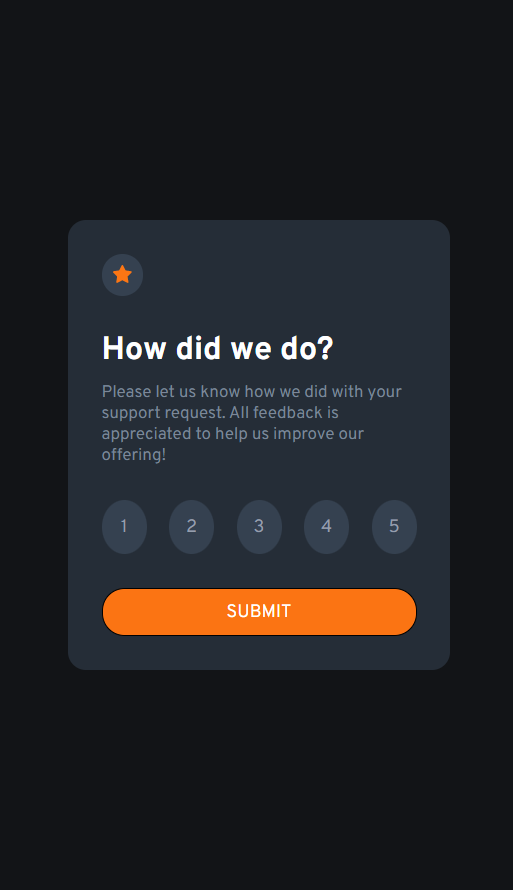
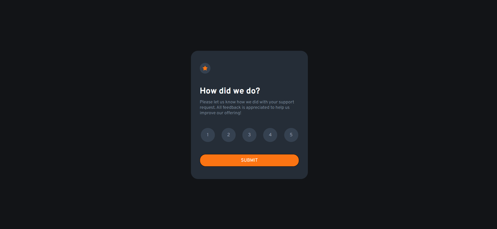

# Frontend Mentor - Interactive rating component solution

This is a solution to the [Interactive rating component challenge on Frontend Mentor](https://www.frontendmentor.io/challenges/interactive-rating-component-koxpeBUmI).

## Table of contents

-   [The challenge](#the-challenge)
-   [Screenshot](#screenshot)
-   [Built with](#built-with)
-   [Author](#author)

## The challenge

Users should be able to:

-   View the optimal layout for the app depending on their device's screen size
-   See hover states for all interactive elements on the page
-   Select and submit a number rating
-   See the "Thank you" card state after submitting a rating

## Screenshot

## Links

-   Solution URL: (https://github.com/tarikdincer/Interactive-Rating-Component)
-   Live Site URL: (https://tarikdincer.github.io/Interactive-Rating-Component)

## Built with

-   Semantic HTML5 markup
-   CSS custom properties
-   Flexbox
-   Mobile-first workflow
-   [React](https://reactjs.org/) - JS library

## Author

-   Frontend Mentor - [@tarikdincer](https://www.frontendmentor.io/profile/tarikdincer)
